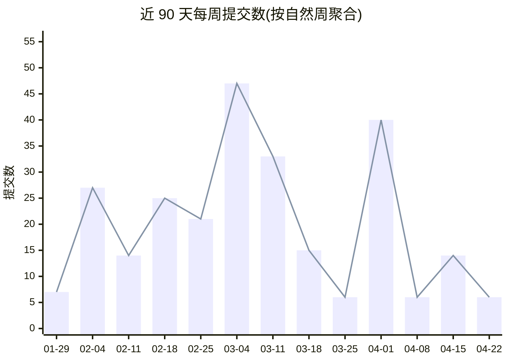
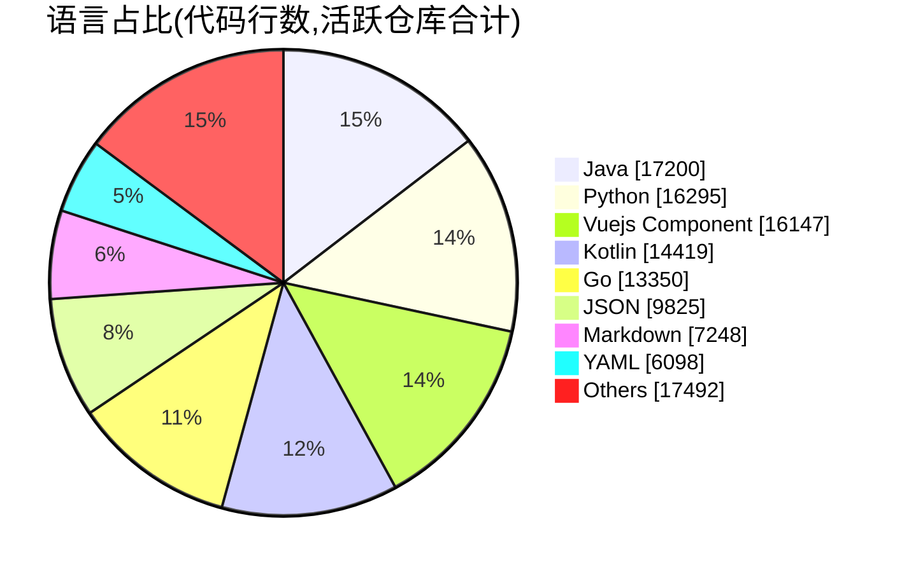

# Conflux-Union

**专注于 Minecraft 红石生存科技与第三方程序开发的社区。**

---

## 关于我们

Conflux-Union 是一个由社区驱动的组织,专注于:

- **Minecraft 红石生存** — 在原版生存环境下进行红石工程实践
- **第三方工具开发** — 围绕 Minecraft 的模组、插件、服务端与周边工具
- **开放协作** — 成员们在公开仓库中共同构建、迭代与交付

---

## 组织概况

<!-- STATS:START -->
| 指标 | 数值 |
|---|---|
| 近 90 天提交总数 | **261** |
| 公开仓库总数 | **26** |
| 活跃仓库数(90d) | **14** |
| 成员总数 | **9** |

<!-- STATS:END -->

---

## 近 90 天每日提交趋势

<!-- CHART_DAILY:START -->

<!-- CHART_DAILY:END -->

---

## 成员贡献榜(近 90 天)

<!-- RANKING:START -->
| 排名 | 成员 | 提交数 |
|---:|:---|---:|
| 🥇 | [@Trirrin](https://github.com/Trirrin) | 187 |
| 🥈 | [@Chonghua-05](https://github.com/Chonghua-05) | 36 |
| 🥉 | [@husbvt](https://github.com/husbvt) | 11 |
| #4 | [@Jog-Ming](https://github.com/Jog-Ming) | 11 |
| #5 | [@VY-L](https://github.com/VY-L) | 9 |
| #6 | [@halfban0](https://github.com/halfban0) _(外部贡献者)_ | 3 |
| #7 | [@mgHurryo](https://github.com/mgHurryo) | 3 |
| #8 | [@Ftimever](https://github.com/Ftimever) | 1 |

<!-- RANKING:END -->

---

## 语言占比(按代码行数,活跃仓库合计)

<!-- LANGUAGES:START -->

| 排名 | 语言 | 占比 | 代码行数 |
|---:|:---|---:|---:|
| #1 | Java | 14.6% | 17,200 |
| #2 | Python | 13.8% | 16,295 |
| #3 | Vuejs Component | 13.7% | 16,147 |
| #4 | Kotlin | 12.2% | 14,419 |
| #5 | Go | 11.3% | 13,350 |
| #6 | JSON | 8.3% | 9,825 |
| #7 | Markdown | 6.1% | 7,248 |
| #8 | YAML | 5.2% | 6,098 |
| — | 其他 | 14.8% | 17,492 |

<!-- LANGUAGES:END -->

---

统计由 GitHub Actions 每日自动刷新 &middot; 最近刷新:<!-- UPDATED:START -->
2026-04-28 06:15 UTC
<!-- UPDATED:END -->

