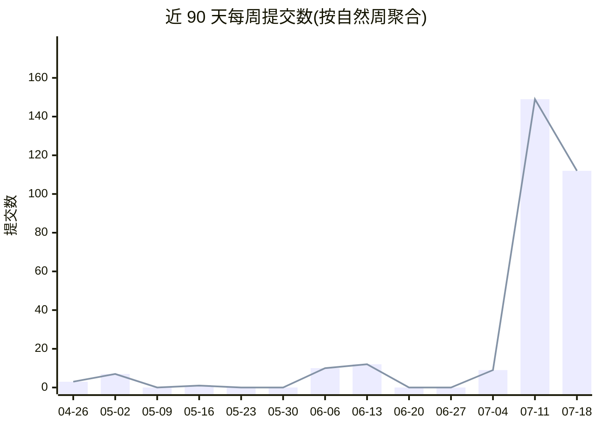
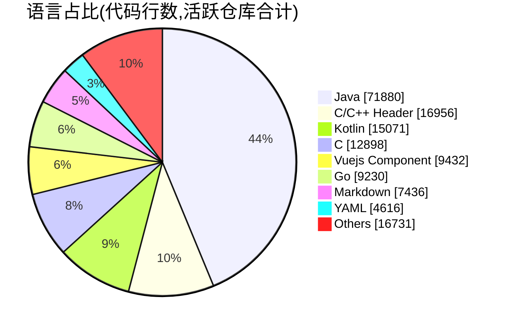

# Conflux-Union

**专注于 Minecraft 红石生存科技与第三方程序开发的社区。**

---

## 关于我们

Conflux-Union 是一个由社区驱动的组织,专注于:

- **Minecraft 红石生存** — 在原版生存环境下进行红石工程实践
- **第三方工具开发** — 围绕 Minecraft 的模组、插件、服务端与周边工具
- **开放协作** — 成员们在公开仓库中共同构建、迭代与交付

---

## 组织概况

<!-- STATS:START -->
| 指标 | 数值 |
|---|---|
| 近 90 天提交总数 | **305** |
| 公开仓库总数 | **30** |
| 活跃仓库数(90d) | **10** |
| 成员总数 | **9** |

<!-- STATS:END -->

---

## 近 90 天每日提交趋势

<!-- CHART_DAILY:START -->

```mermaid
xychart-beta
    title "近 90 天每周提交数(按自然周聚合)"
    x-axis ["04-26", "05-02", "05-09", "05-16", "05-23", "05-30", "06-06", "06-13", "06-20", "06-27", "07-04", "07-11", "07-18"]
    y-axis "提交数" 0 --> 178
    bar [3, 7, 0, 1, 0, 0, 10, 12, 0, 0, 9, 149, 112]
    line [3, 7, 0, 1, 0, 0, 10, 12, 0, 0, 9, 149, 112]
```

<!-- CHART_DAILY:END -->

---

## 成员贡献榜(近 90 天)

<!-- RANKING:START -->
| 排名 | 成员 | 提交数 |
|---:|:---|---:|
| 🥇 | [@Trirrin](https://github.com/Trirrin) | 219 |
| 🥈 | [@mgHurryo](https://github.com/mgHurryo) | 81 |
| 🥉 | [@Chonghua-05](https://github.com/Chonghua-05) | 4 |
| #4 | [@chonghua](https://github.com/chonghua) _(外部贡献者)_ | 1 |

<!-- RANKING:END -->

---

## 语言占比(按代码行数,活跃仓库合计)

<!-- LANGUAGES:START -->

```mermaid
pie showData
    title 语言占比(代码行数,活跃仓库合计)
    "Java" : 71880
    "C/C++ Header" : 16956
    "Kotlin" : 15071
    "C" : 12898
    "Vuejs Component" : 9432
    "Go" : 9230
    "Markdown" : 7436
    "YAML" : 4616
    "Others" : 16731
```

| 排名 | 语言 | 占比 | 代码行数 |
|---:|:---|---:|---:|
| #1 | Java | 43.8% | 71,880 |
| #2 | C/C++ Header | 10.3% | 16,956 |
| #3 | Kotlin | 9.2% | 15,071 |
| #4 | C | 7.9% | 12,898 |
| #5 | Vuejs Component | 5.7% | 9,432 |
| #6 | Go | 5.6% | 9,230 |
| #7 | Markdown | 4.5% | 7,436 |
| #8 | YAML | 2.8% | 4,616 |
| — | 其他 | 10.2% | 16,731 |

<!-- LANGUAGES:END -->

---

统计由 GitHub Actions 每日自动刷新 &middot; 最近刷新:<!-- UPDATED:START -->
2026-07-24 06:05 UTC
<!-- UPDATED:END -->

