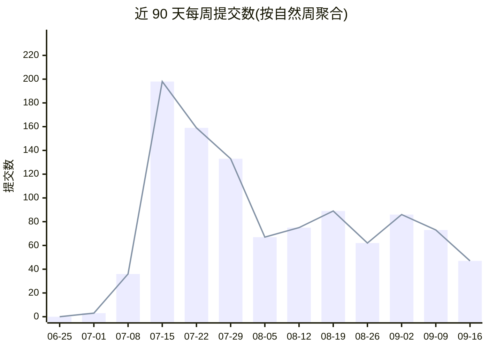

# Conflux-Union

**专注于 Minecraft 红石生存科技与第三方程序开发的社区。**

---

## 关于我们

Conflux-Union 是一个由社区驱动的组织,专注于:

- **Minecraft 红石生存** — 在原版生存环境下进行红石工程实践
- **第三方工具开发** — 围绕 Minecraft 的模组、插件、服务端与周边工具
- **开放协作** — 成员们在公开仓库中共同构建、迭代与交付

---

## 组织概况

<!-- STATS:START -->
| 指标 | 数值 |
|---|---|
| 近 90 天提交总数 | **1028** |
| 公开仓库总数 | **34** |
| 活跃仓库数(90d) | **13** |
| 成员总数 | **9** |

<!-- STATS:END -->

---

## 近 90 天每日提交趋势

<!-- CHART_DAILY:START -->

```mermaid
xychart-beta
    title "近 90 天每周提交数(按自然周聚合)"
    x-axis ["06-25", "07-01", "07-08", "07-15", "07-22", "07-29", "08-05", "08-12", "08-19", "08-26", "09-02", "09-09", "09-16"]
    y-axis "提交数" 0 --> 237
    bar [0, 3, 36, 198, 159, 133, 67, 75, 89, 62, 86, 73, 47]
    line [0, 3, 36, 198, 159, 133, 67, 75, 89, 62, 86, 73, 47]
```

<!-- CHART_DAILY:END -->

---

## 成员贡献榜(近 90 天)

<!-- RANKING:START -->
| 排名 | 成员 | 提交数 |
|---:|:---|---:|
| 🥇 | [@Trirrin](https://github.com/Trirrin) | 864 |
| 🥈 | [@mgHurryo](https://github.com/mgHurryo) | 127 |
| 🥉 | [@xpple](https://github.com/xpple) _(外部贡献者)_ | 18 |
| #4 | [@Chonghua-05](https://github.com/Chonghua-05) | 10 |
| #5 | [@Spagles](https://github.com/Spagles) _(外部贡献者)_ | 2 |
| #6 | [@Whisperlyric](https://github.com/Whisperlyric) _(外部贡献者)_ | 2 |
| #7 | [@yqs112358](https://github.com/yqs112358) _(外部贡献者)_ | 2 |
| #8 | [@Bishops-exe](https://github.com/Bishops-exe) _(外部贡献者)_ | 1 |
| #9 | [@Copilot](https://github.com/Copilot) _(外部贡献者)_ | 1 |
| #10 | [@Nel-S](https://github.com/Nel-S) _(外部贡献者)_ | 1 |

<!-- RANKING:END -->

---

## 语言占比(按代码行数,活跃仓库合计)

<!-- LANGUAGES:START -->

```mermaid
pie showData
    title 语言占比(代码行数,活跃仓库合计)
    "Java" : 172155
    "C" : 35051
    "C/C++ Header" : 31826
    "JSON" : 29350
    "Go" : 18020
    "TypeScript" : 17948
    "Kotlin" : 17877
    "Vuejs Component" : 16840
    "Others" : 31238
```

| 排名 | 语言 | 占比 | 代码行数 |
|---:|:---|---:|---:|
| #1 | Java | 46.5% | 172,155 |
| #2 | C | 9.5% | 35,051 |
| #3 | C/C++ Header | 8.6% | 31,826 |
| #4 | JSON | 7.9% | 29,350 |
| #5 | Go | 4.9% | 18,020 |
| #6 | TypeScript | 4.8% | 17,948 |
| #7 | Kotlin | 4.8% | 17,877 |
| #8 | Vuejs Component | 4.5% | 16,840 |
| — | 其他 | 8.4% | 31,238 |

<!-- LANGUAGES:END -->

---

统计由 GitHub Actions 每日自动刷新 &middot; 最近刷新:<!-- UPDATED:START -->
2026-09-22 08:37 UTC
<!-- UPDATED:END -->

