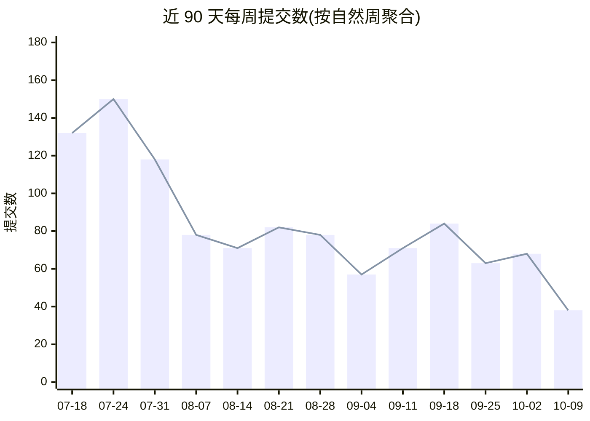
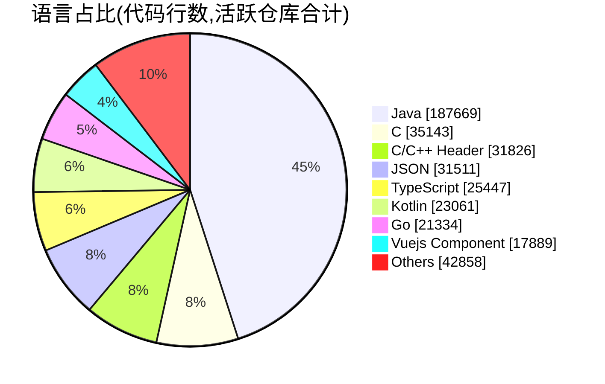

# Conflux-Union

**专注于 Minecraft 红石生存科技与第三方程序开发的社区。**

---

## 关于我们

Conflux-Union 是一个由社区驱动的组织,专注于:

- **Minecraft 红石生存** — 在原版生存环境下进行红石工程实践
- **第三方工具开发** — 围绕 Minecraft 的模组、插件、服务端与周边工具
- **开放协作** — 成员们在公开仓库中共同构建、迭代与交付

---

## 组织概况

<!-- STATS:START -->
| 指标 | 数值 |
|---|---|
| 近 90 天提交总数 | **1140** |
| 公开仓库总数 | **39** |
| 活跃仓库数(90d) | **19** |
| 成员总数 | **10** |

<!-- STATS:END -->

---

## 近 90 天每日提交趋势

<!-- CHART_DAILY:START -->

```mermaid
xychart-beta
    title "近 90 天每周提交数(按自然周聚合)"
    x-axis ["07-18", "07-24", "07-31", "08-07", "08-14", "08-21", "08-28", "09-04", "09-11", "09-18", "09-25", "10-02", "10-09"]
    y-axis "提交数" 0 --> 180
    bar [132, 150, 118, 78, 71, 82, 78, 57, 71, 84, 63, 68, 38]
    line [132, 150, 118, 78, 71, 82, 78, 57, 71, 84, 63, 68, 38]
```

<!-- CHART_DAILY:END -->

---

## 成员贡献榜(近 90 天)

<!-- RANKING:START -->
| 排名 | 成员 | 提交数 |
|---:|:---|---:|
| 🥇 | [@Trirrin](https://github.com/Trirrin) | 1000 |
| 🥈 | [@mgHurryo](https://github.com/mgHurryo) | 88 |
| 🥉 | [@xpple](https://github.com/xpple) _(外部贡献者)_ | 18 |
| #4 | [@Chonghua-05](https://github.com/Chonghua-05) | 17 |
| #5 | [@late-maple](https://github.com/late-maple) _(外部贡献者)_ | 4 |
| #6 | [@Nero978](https://github.com/Nero978) _(外部贡献者)_ | 3 |
| #7 | [@Spagles](https://github.com/Spagles) _(外部贡献者)_ | 2 |
| #8 | [@Whisperlyric](https://github.com/Whisperlyric) _(外部贡献者)_ | 2 |
| #9 | [@yqs112358](https://github.com/yqs112358) _(外部贡献者)_ | 2 |
| #10 | [@Bishops-exe](https://github.com/Bishops-exe) _(外部贡献者)_ | 1 |
| #11 | [@Copilot](https://github.com/Copilot) _(外部贡献者)_ | 1 |
| #12 | [@Nel-S](https://github.com/Nel-S) _(外部贡献者)_ | 1 |
| #13 | [@zQianWan](https://github.com/zQianWan) | 1 |

<!-- RANKING:END -->

---

## 语言占比(按代码行数,活跃仓库合计)

<!-- LANGUAGES:START -->

```mermaid
pie showData
    title 语言占比(代码行数,活跃仓库合计)
    "Java" : 187669
    "C" : 35143
    "C/C++ Header" : 31826
    "JSON" : 31511
    "TypeScript" : 25447
    "Kotlin" : 23061
    "Go" : 21334
    "Vuejs Component" : 17889
    "Others" : 42858
```

| 排名 | 语言 | 占比 | 代码行数 |
|---:|:---|---:|---:|
| #1 | Java | 45.0% | 187,669 |
| #2 | C | 8.4% | 35,143 |
| #3 | C/C++ Header | 7.6% | 31,826 |
| #4 | JSON | 7.6% | 31,511 |
| #5 | TypeScript | 6.1% | 25,447 |
| #6 | Kotlin | 5.5% | 23,061 |
| #7 | Go | 5.1% | 21,334 |
| #8 | Vuejs Component | 4.3% | 17,889 |
| — | 其他 | 10.3% | 42,858 |

<!-- LANGUAGES:END -->

---

统计由 GitHub Actions 每日自动刷新 &middot; 最近刷新:<!-- UPDATED:START -->
2026-10-15 08:23 UTC
<!-- UPDATED:END -->

