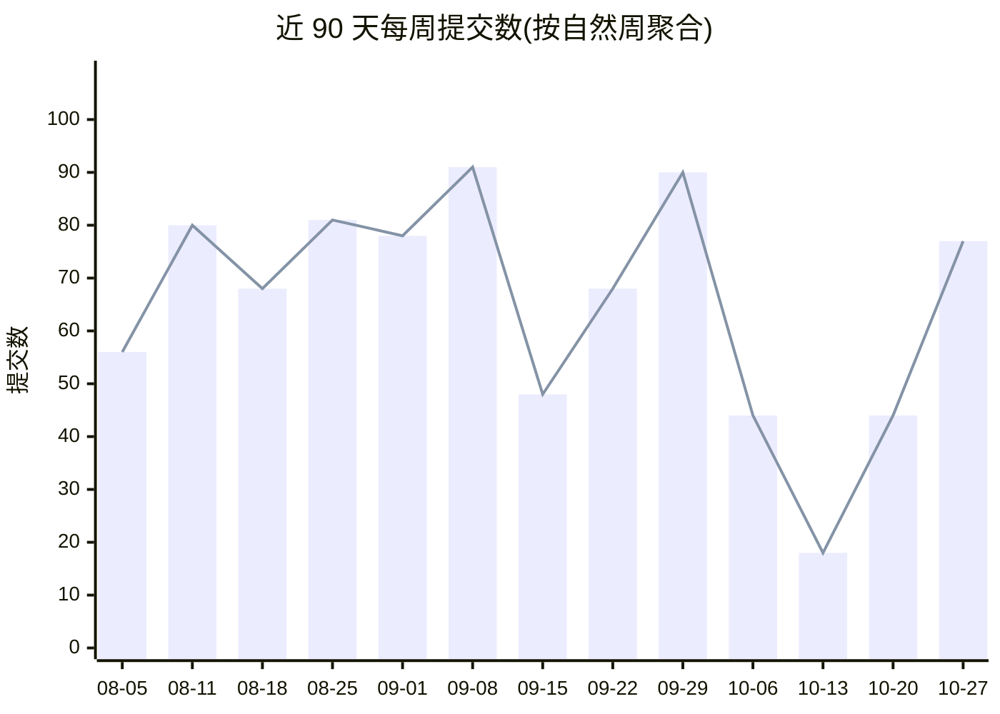
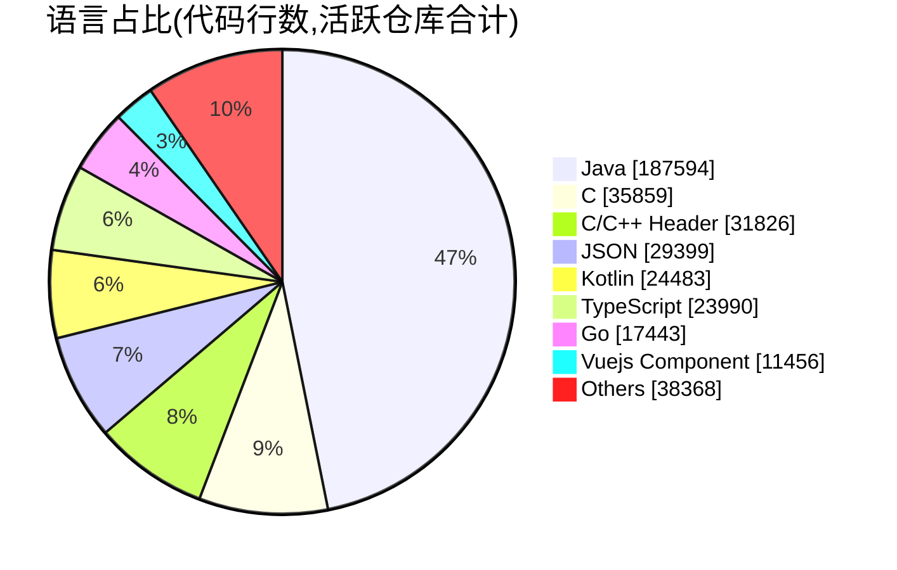

<picture>
  <source media="(prefers-color-scheme: dark)" srcset="https://raw.githubusercontent.com/Conflux-Union/.github/main/profile/assets/logo-dark.png" />
  
</picture>

# Conflux-Union

**专注于 Minecraft 红石生存科技与第三方程序开发的社区。**

---

## 关于我们

Conflux-Union 是一个由社区驱动的组织,专注于:

- **Minecraft 红石生存** — 在原版生存环境下进行红石工程实践
- **第三方工具开发** — 围绕 Minecraft 的模组、插件、服务端与周边工具
- **开放协作** — 成员们在公开仓库中共同构建、迭代与交付

---

## 组织概况

<!-- STATS:START -->
| 指标 | 数值 |
|---|---|
| 近 90 天提交总数 | **847** |
| 公开仓库总数 | **39** |
| 活跃仓库数(90d) | **16** |
| 成员总数 | **10** |

<!-- STATS:END -->

---

## 近 90 天每日提交趋势

<!-- CHART_DAILY:START -->

```mermaid
xychart-beta
    title "近 90 天每周提交数(按自然周聚合)"
    x-axis ["08-05", "08-11", "08-18", "08-25", "09-01", "09-08", "09-15", "09-22", "09-29", "10-06", "10-13", "10-20", "10-27"]
    y-axis "提交数" 0 --> 109
    bar [56, 80, 68, 81, 78, 91, 48, 68, 90, 44, 18, 44, 77]
    line [56, 80, 68, 81, 78, 91, 48, 68, 90, 44, 18, 44, 77]
```

<!-- CHART_DAILY:END -->

---

## 成员贡献榜(近 90 天)

<!-- RANKING:START -->
| 排名 | 成员 | 提交数 |
|---:|:---|---:|
| 🥇 | [@Trirrin](https://github.com/Trirrin) | 770 |
| 🥈 | [@mgHurryo](https://github.com/mgHurryo) | 33 |
| 🥉 | [@Chonghua-05](https://github.com/Chonghua-05) | 18 |
| #4 | [@xpple](https://github.com/xpple) _(外部贡献者)_ | 13 |
| #5 | [@late-maple](https://github.com/late-maple) _(外部贡献者)_ | 5 |
| #6 | [@Nero978](https://github.com/Nero978) _(外部贡献者)_ | 3 |
| #7 | [@Whisperlyric](https://github.com/Whisperlyric) _(外部贡献者)_ | 2 |
| #8 | [@Copilot](https://github.com/Copilot) _(外部贡献者)_ | 1 |
| #9 | [@Nel-S](https://github.com/Nel-S) _(外部贡献者)_ | 1 |
| #10 | [@zQianWan](https://github.com/zQianWan) | 1 |

<!-- RANKING:END -->

---

## 语言占比(按代码行数,活跃仓库合计)

<!-- LANGUAGES:START -->

```mermaid
pie showData
    title 语言占比(代码行数,活跃仓库合计)
    "Java" : 187594
    "C" : 35859
    "C/C++ Header" : 31826
    "JSON" : 29399
    "Kotlin" : 24483
    "TypeScript" : 23990
    "Go" : 17443
    "Vuejs Component" : 11456
    "Others" : 38368
```

| 排名 | 语言 | 占比 | 代码行数 |
|---:|:---|---:|---:|
| #1 | Java | 46.8% | 187,594 |
| #2 | C | 9.0% | 35,859 |
| #3 | C/C++ Header | 7.9% | 31,826 |
| #4 | JSON | 7.3% | 29,399 |
| #5 | Kotlin | 6.1% | 24,483 |
| #6 | TypeScript | 6.0% | 23,990 |
| #7 | Go | 4.4% | 17,443 |
| #8 | Vuejs Component | 2.9% | 11,456 |
| — | 其他 | 9.6% | 38,368 |

<!-- LANGUAGES:END -->

---

统计由 GitHub Actions 每日自动刷新 &middot; 最近刷新:<!-- UPDATED:START -->
2026-11-02 11:19 UTC
<!-- UPDATED:END -->

